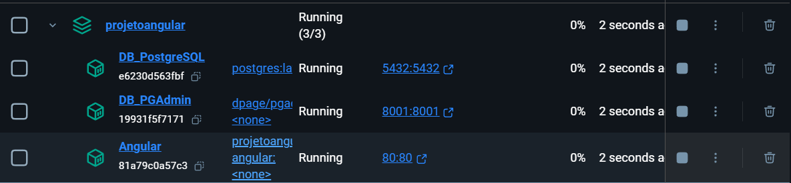

# Projeto Angular

Projeto focado no meu estudo para as tecnologias de Java/Spring/Maven/Docker e principalmente Angular na qual eu nunca utilizei.

## Pré-requisitos

* Postgres: [Download](https://www.postgresql.org/download/)
* Java: [Download](https://www.java.com/pt-BR/download/manual.jsp)
* Docker: [Download](https://www.docker.com/products/docker-desktop/)
* IDE (IntelliJ recomendada)

## Instalação

1. Instale o Postgres, Java e Docker conforme os links acima.
2. Clone o repositório do projeto:
    ```bash
    git clone <URL_DO_REPOSITORIO>
    cd <NOME_DO_REPOSITORIO>
    ```

## Deploy

Para fazer o deploy desse projeto, execute:

```bash
docker-compose up -d
```

Se tudo ocorrer bem, os contêineres irão ficar dessa forma: </img>

## PgAdmin

Foi criado pelo Docker, não há necessidade de utilizar o Software.
Caso utilizar pelo Software pular para o topico de configuração do DB

#### Conectando no PgAdmin

* Ele ira ser iniciado na porta http://localhost:8001/
    1. Login: admin@admin.com
    2. Senha: password

#### Configuração do DB

    1. No pgAdmin, clique com o botão direito em Servers no painel esquerdo e selecione
     Create > Server.
    2. Configuração do servidor:
    Na janela de criação do servidor, siga as etapas abaixo.
        1. Na aba "General".
        2. Name: Escolha um nome para o servidor (por exemplo, PostgreSQL-Docker).
        3. Na aba "Connection":
        4. Host name/address: postgres 
        5. Port: 5432 (conforme configurado no seu arquivo docker-compose.yml).
        6. Maintenance database: postgres (o nome do banco de dados que você configurou).
        7. Username: postgres (o usuário configurado no container).
        8. Password: postgres (a senha configurada no container).

    3. Salvar e conectar:
        1. Após preencher os campos, clique em Save.
        2. O servidor será adicionado à lista no painel esquerdo e você poderá navegar pelas bases de dados.

# Estrutura do Projeto
### (v1.0.0)
````.
├── src
│   ├── main
│   │   ├── java
│   │   └── resources
│   └── test
├── .mvn
├── Dockerfile
├── docker-compose.yml
├── README.md
└── etc
````